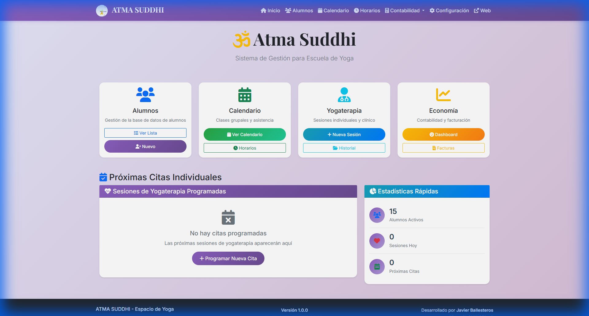
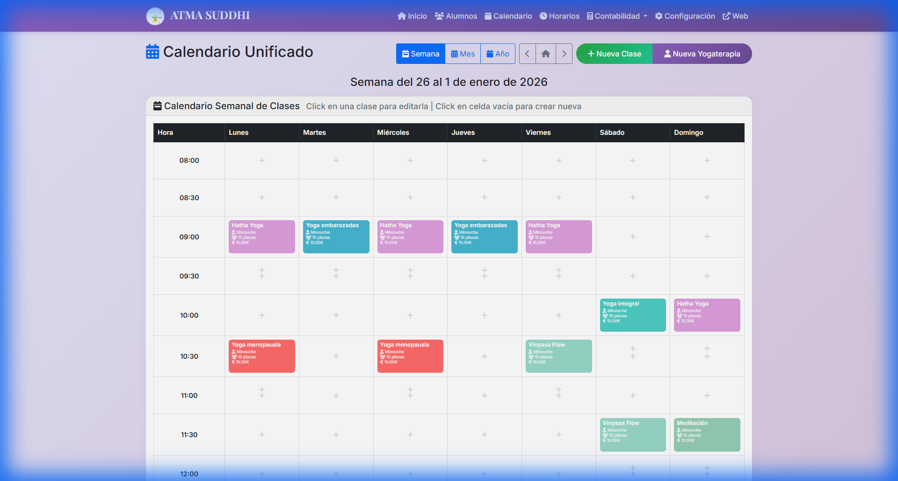
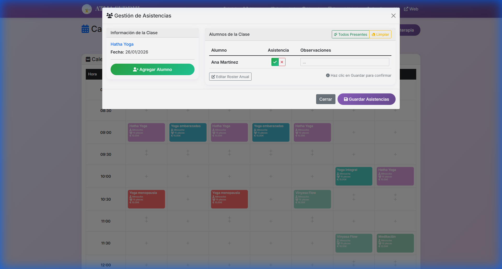
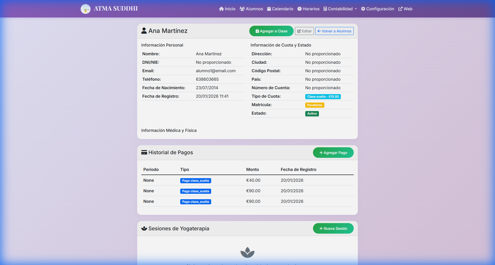
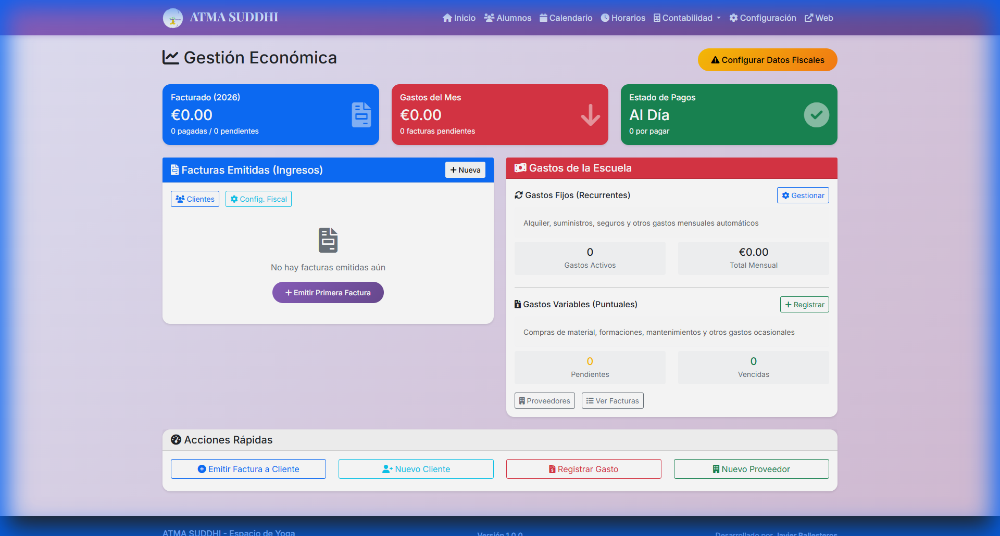

# 🧘‍♀️ ATMA SUDDHI - Yoga School Management System

Sistema completo de gestión para una escuela de yoga que incluye gestión de alumnos, pagos, citas individuales de yogaterapia, horarios semanales, calendario unificado y administración de clases.

**Desarrollado por:** Javier Ballesteros para Atma Suddhi - Espacio de Yoga  
**Licencia:** GNU GPL v3  
**Versión:** 2.0.0

## 📋 Tabla de Contenidos

- [Visualización](#-visualización)
- [Características Principales](#-características-principales)
- [Funcionalidades Detalladas](#-funcionalidades-detalladas)
- [Tecnologías Utilizadas](#-tecnologías-utilizadas)
- [Instalación](#-instalación)
- [Uso del Sistema](#-uso-del-sistema)
- [Estructura del Proyecto](#-estructura-del-proyecto)
- [Pendientes](#-pendientes)
- [Contribución](#-contribución)

## 📸 Visualización

### 🏠 Inicio (Dashboard Principal)
Interfaz simplificada con acceso directo a las áreas más importantes: Alumnos, Calendario, Yogaterapia y Economía.

### 📅 Calendario y Gestión de Asistencias
Vista unificada de clases con capacidad de pasar lista diariamente de forma sencilla.

### 👤 Perfil del Alumno
Historial completo de asistencias, estadísticas y sesiones de yogaterapia.

### 📊 Gestión Económica
Dashboard de contabilidad, gastos y facturación.

## 🌟 Características Principales

### 🎯 **Gestión Completa de Alumnos**
- Registro y edición de información personal
- Historial de pagos y asistencia
- Seguimiento de progreso individual
- Gestión de contactos y comunicaciones

### 💰 **Sistema de Pagos Avanzado**
- Registro de pagos por clase suelta o bono
- Seguimiento de pagos pendientes
- Historial completo de transacciones
- Reportes de ingresos

### 🧘‍♀️ **Yogaterapia Individual**
- Sistema completo de citas individuales
- Registro detallado de sesiones terapéuticas
- Subida de archivos de práctica personal
- Seguimiento de objetivos terapéuticos
- Evaluación y recomendaciones

### 📅 **Calendario Unificado**
- **Vista Mensual**: Calendario completo con navegación entre meses
- **Vista Semanal**: Gestión detallada de la semana actual
- **Vista Anual**: 12 mini-calendarios con estadísticas del año
- Indicadores visuales para citas y horarios
- Creación de citas desde cualquier día

### ⏰ **Gestión de Horarios**
- Configuración de horarios semanales recurrentes
- Diferentes tipos de clases con precios personalizables
- Gestión de instructores y capacidad
- Horarios activos/inactivos

### ⚙️ **Configuración del Sistema**
- Gestión de tipos de clase
- Configuración de precios y duraciones
- Categorías de gastos
- Proveedores y facturación

## 👨‍💻 Información del Autor

**Desarrollador:** Javier Ballesteros  
**Email:** javierb507@gmail.com  
**Proyecto:** Desarrollado específicamente para Atma Suddhi - Espacio de Yoga  
**Repositorio:** https://github.com/javierb507/yoga-school-management

## 📄 Licencia

Este proyecto está licenciado bajo la Licencia Pública General de GNU v3.0 (GPL-3.0).

Para más información sobre la licencia, consulta el archivo [LICENSE](LICENSE) o visita: https://www.gnu.org/licenses/gpl-3.0.html

## 🤝 Contribución

Este proyecto fue desarrollado específicamente para Atma Suddhi, pero está disponible como software libre bajo licencia GPL v3. Si deseas contribuir o adaptar el sistema para tu propia escuela de yoga, por favor:

1. Fork el repositorio
2. Crea una rama para tu feature (`git checkout -b feature/nueva-funcionalidad`)
3. Commit tus cambios (`git commit -am 'Agregar nueva funcionalidad'`)
4. Push a la rama (`git push origin feature/nueva-funcionalidad`)
5. Crea un Pull Request

## 📞 Contacto

Para consultas sobre el sistema o soporte técnico, contacta a:
- **Javier Ballesteros** - javierb507@gmail.com
- **Atma Suddhi** - Espacio de Yoga