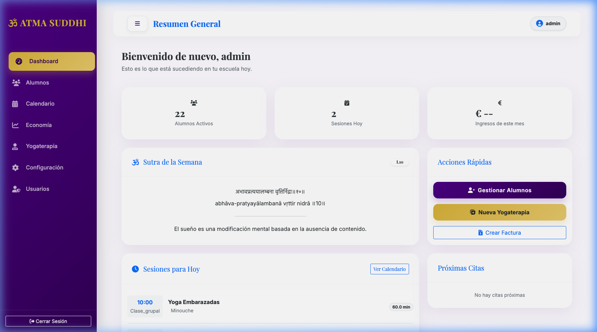
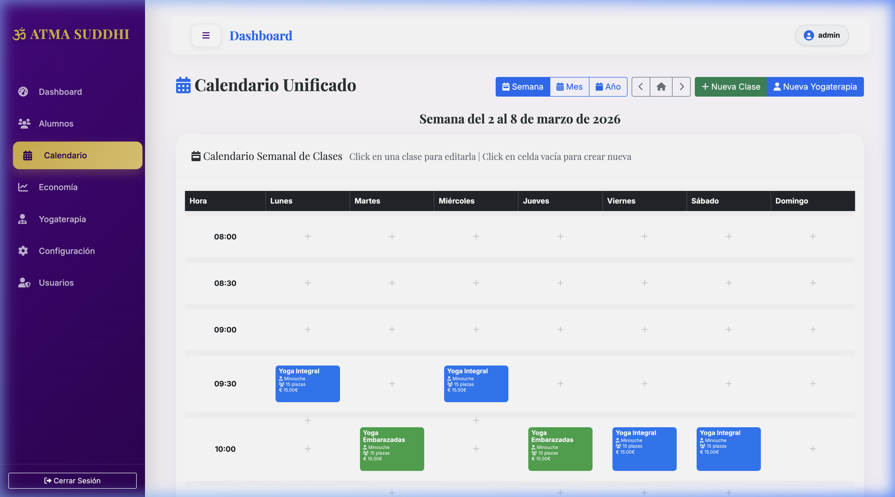
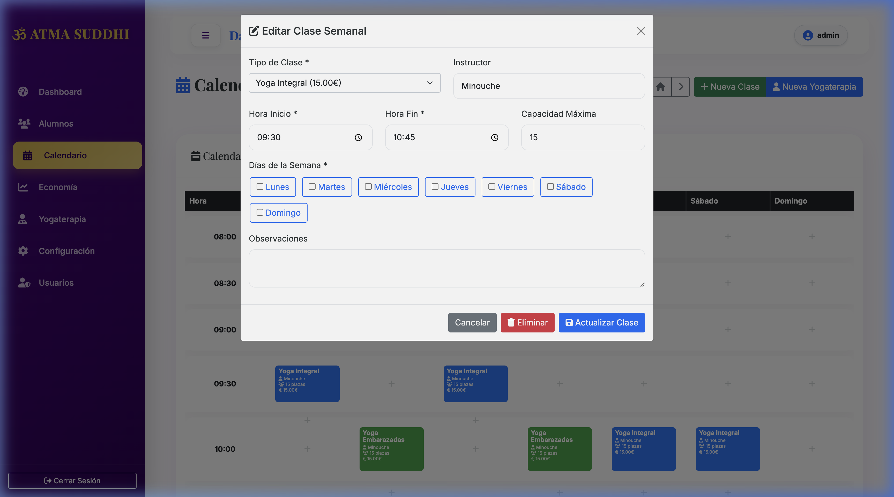
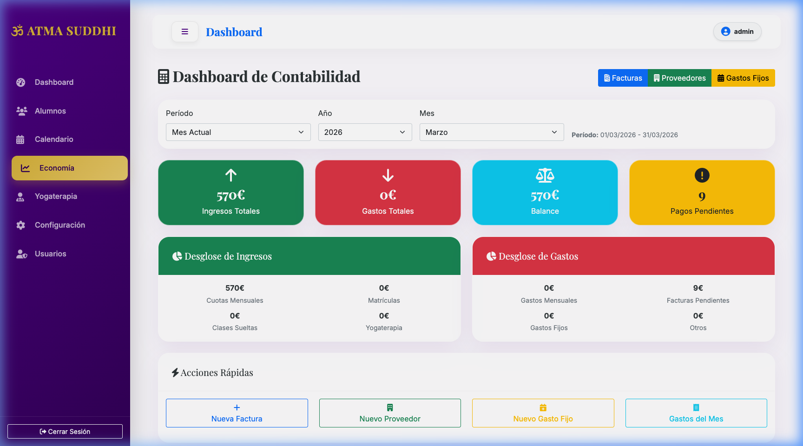

  

# 🧘‍♀️ DarmaSala — Community Edition

Sistema de gestión para una escuela de yoga: alumnos, pagos, asistencia, yogaterapia, horarios semanales, calendario unificado, facturación española y administración de clases.

**Desarrollado por:** Javier Ballesteros para DarmaSala - Espacio de Yoga
**Licencia:** GNU AGPL v3
**Versión:** 2.0.0-community

## Ediciones

Existen dos ediciones del proyecto:

| Edición | Distribución | Portal alumnos | Audiencia |
|---------|--------------|----------------|-----------|
| **Community** (este repo) | Pública, AGPL-3 | ❌ | Despliegue local en una escuela individual |
| **Enterprise** | Privada | ✅ + reservas, pagos online, lista de espera | SaaS gestionado |

La Community Edition está pensada para correr en local (un PC, una intranet) sin exposición pública. Por eso no incluye:

- Portal de alumnos (`/portal/*`)
- Login con rol `alumno`
- PWA / Service Worker
- Reset de contraseña por email a alumnos
- Reservas y pagos online desde portal

Todo lo demás (gestión administrativa completa, facturación, yogaterapia, calendario) está incluido.

## 🌿 Inspiración

> "El éxito del yoga no radica en la capacidad de realizar posturas, sino en cómo cambia positivamente nuestra forma de vivir la vida y nuestras relaciones."  
> — *T.K.V. Desikachar*

**Reflexión:**  
DarmaSala nace con esa misma intención: medir el valor no por la postura técnica del sistema, sino por cómo libera tiempo a practicantes y maestros para que vivan mejor su práctica y sus vínculos. Organizar lo múltiple (alumnos, clases, finanzas) en una estructura armónica es sólo un medio para que lo esencial pueda respirar.

## 📋 Tabla de Contenidos

- [Visualización](#-visualización)
- [Inspiración](#-inspiración)
- [Características Principales](#-características-principales)
- [Funcionalidades Detalladas](#-funcionalidades-detalladas)
- [Tecnologías Utilizadas](#-tecnologías-utilizadas)
- [Instalación](#-instalación)
- [Uso del Sistema](#-uso-del-sistema)
- [Estructura del Proyecto](#-estructura-del-proyecto)
- [Pendientes](#-pendientes)
- [Contribución](#-contribución)

## 📸 Visualización

### 🏠 Inicio (Dashboard Principal)
Interfaz premium con el tema "Moss Green & Sage", alineado con la identidad visual de darmasala.cloud. Acceso directo a Alumnos, Calendario, Yogaterapia y Economía.

### 📅 Calendario y Gestión de Asistencias
Vista unificada de clases con capacidad de pasar lista de forma visual y moderna.

### 📊 Gestión Económica
Dashboard de contabilidad avanzado con resumen de ingresos, gastos y balance mensual/anual.

## 🌟 Características Principales

### 🎯 **Gestión Completa de Alumnos**
- Registro y edición de información personal
- Historial de pagos y asistencia
- Seguimiento de progreso individual
- Gestión de contactos y comunicaciones

### 💰 **Sistema de Pagos Avanzado**
- Registro de pagos por clase suelta o bono
- Seguimiento de pagos pendientes
- Historial completo de transacciones
- Reportes de ingresos

### 🧘‍♀️ **Yogaterapia Individual**
- Sistema completo de citas individuales
- Registro detallado de sesiones terapéuticas
- Subida de archivos de práctica personal
- Seguimiento de objetivos terapéuticos
- Evaluación y recomendaciones

### 📅 **Calendario Unificado**
- **Vista Mensual**: Calendario completo con navegación entre meses
- **Vista Semanal**: Gestión detallada de la semana actual
- **Vista Anual**: 12 mini-calendarios con estadísticas del año
- Indicadores visuales para citas y horarios
- Creación de citas desde cualquier día

### ⏰ **Gestión de Horarios**
- Configuración de horarios semanales recurrentes
- Diferentes tipos de clases con precios personalizables
- Gestión de instructores y capacidad
- Horarios activos/inactivos

### ⚙️ **Configuración del Sistema**
- Gestión de tipos de clase
- Configuración de precios y duraciones
- Categorías de gastos
- Proveedores y facturación

## 👨‍💻 Información del Autor

**Desarrollador:** Javier Ballesteros  
**Email:** javierb507@gmail.com  
**Proyecto:** Desarrollado específicamente para DarmaSala - Espacio de Yoga  
**Repositorio:** https://github.com/javierb507/darmasala

## 📄 Licencia

DarmaSala Community Edition se distribuye bajo la **GNU Affero General Public License v3.0** ([LICENSE](LICENSE)).

La licencia AGPL exige que cualquier servicio público derivado de este código publique sus modificaciones bajo la misma licencia. Si necesitas una licencia comercial o una versión gestionada (DarmaSala Enterprise), contacta con el autor.

## 🤝 Contribución

Si deseas contribuir o adaptar el sistema para tu propia escuela de yoga, por favor:

1. Fork el repositorio
2. Crea una rama para tu feature (`git checkout -b feature/nueva-funcionalidad`)
3. Commit tus cambios (`git commit -am 'Agregar nueva funcionalidad'`)
4. Push a la rama (`git push origin feature/nueva-funcionalidad`)
5. Crea un Pull Request

## 🚀 Despliegue en Producción (Linux VPS)

Para facilitar el despliegue en un VPS Linux (Ubuntu/Debian), se han incluido scripts de automatización en la carpeta `scripts/`:

1.  **Instalación automática**: Ejecuta `./scripts/setup_vps.sh` para instalar dependencias y preparar el entorno virtual.
2.  **Servicio de sistema**: Utiliza la plantilla `scripts/darmasala.service` para configurar el sistema como un servicio de `systemd` que se inicie automáticamente.

Consulta la guía detallada en [docs/deployment-ubuntu.md](docs/deployment-ubuntu.md) para más información sobre la configuración de Nginx y certificados SSL.

## 📞 Contacto

Para consultas sobre el sistema o soporte técnico, contacta a:
- **Javier Ballesteros** - javierb507@gmail.com
- **DarmaSala** - Espacio de Yoga