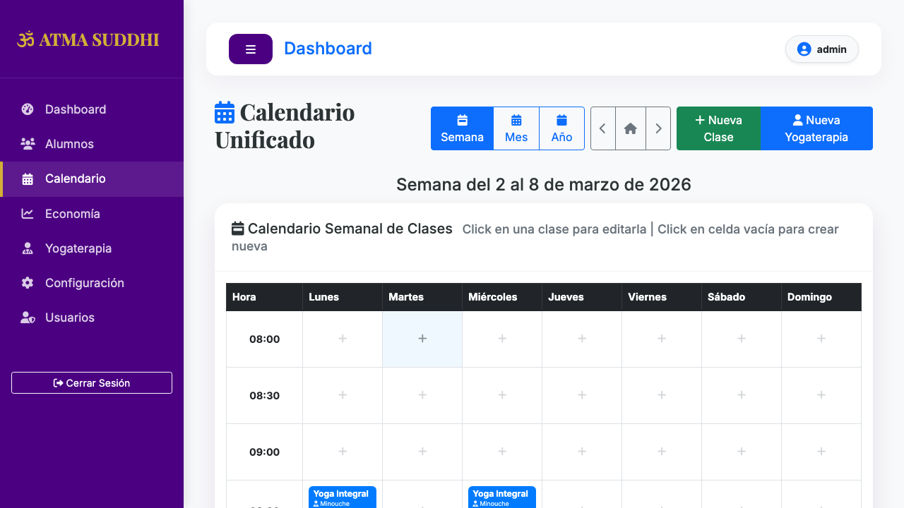
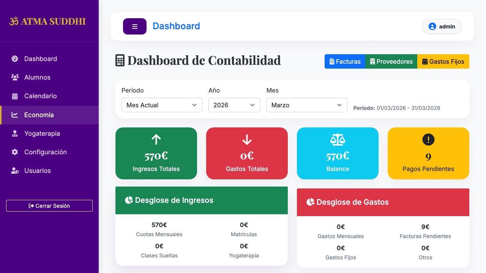
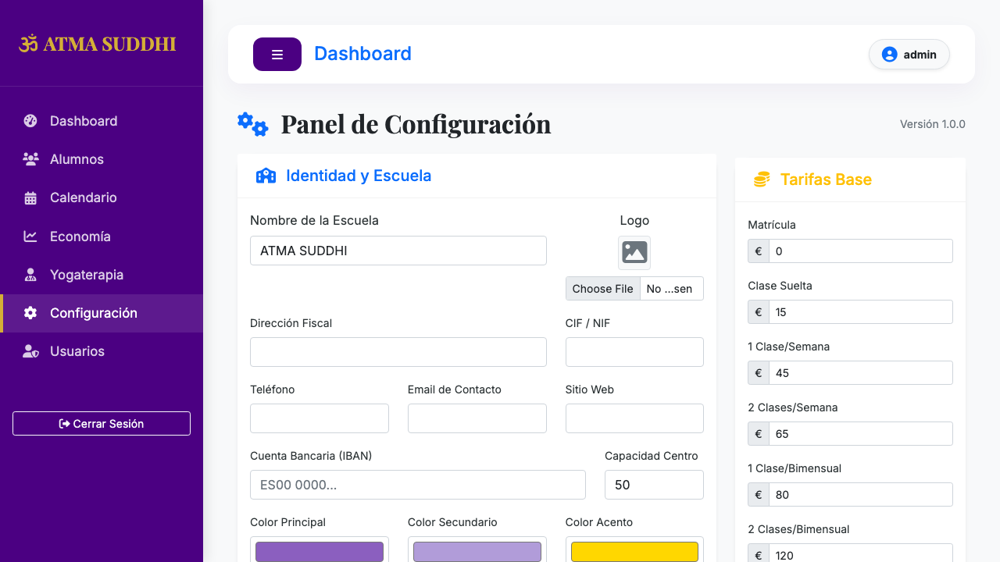
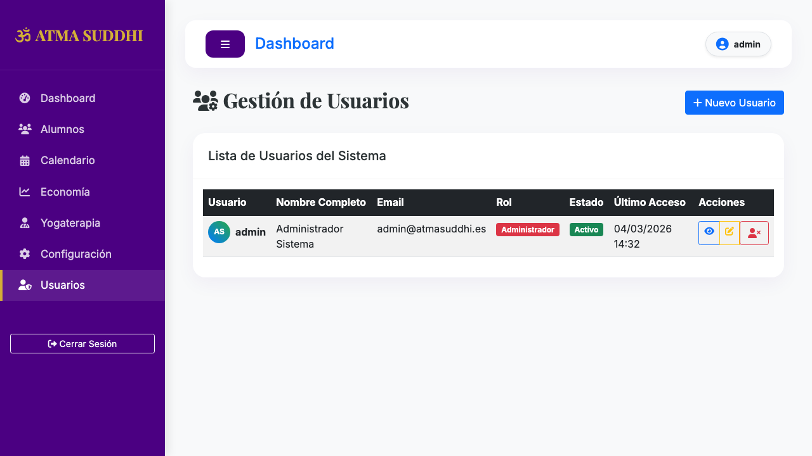

# 🕵️ Testing Agent Report - 2026-03-04 15:32:20

## 📝 Summary
- Errors Found: 0
- Usability & Exploration Notes: 14
- Potential Improvements: 0
- Screenshots Captured: 12

## ❌ Errors & Bugs
No critical errors found during exploration.

## 💡 Suggested Improvements & Usability
- Accessing http://127.0.0.1:5001
- Redirected to login page.
- Login successful. Accessing dashboard.
- Found 10 internal links to explore: ['Alumnos', 'Calendario', 'Economía', 'Yogaterapia', 'Configuración', 'Usuarios', 'Cerrar Sesión', 'admin', 'Nueva Yogaterapia', 'Crear Factura']
- Visiting: Alumnos (http://127.0.0.1:5001/alumnos)
- Visiting: Calendario (http://127.0.0.1:5001/calendario)
- Visiting: Economía (http://127.0.0.1:5001/economia/historico)
- Visiting: Yogaterapia (http://127.0.0.1:5001/yogaterapia)
- Visiting: Configuración (http://127.0.0.1:5001/configuracion)
- Visiting: Usuarios (http://127.0.0.1:5001/usuarios)
- Visiting: Cerrar Sesión (http://127.0.0.1:5001/logout)
- Visiting: admin (http://127.0.0.1:5001/perfil)
- Visiting: Nueva Yogaterapia (http://127.0.0.1:5001/yogaterapia/nueva)
- Visiting: Crear Factura (http://127.0.0.1:5001/facturas/nueva)

## 📸 Visual Audit (Screenshots)
| Section | Screenshot |
| --- | --- |
| Login |  |
| Dashboard |  |
| Section |  |
| Section |  |
| Section |  |
| Section |  |
| Section |  |
| Section |  |
| Section |  |
| Section |  |
| Section |  |
| Section |  |

---
### 📜 Literary Inspiration
> "Caminante, son tus huellas el camino y nada más; caminante, no hay camino, se hace camino al andar." — Antonio Machado, *Campos de Castilla*.

Al igual que en los versos de Machado, este agente de pruebas ha trazado su propia ruta a través de la arquitectura del sistema, no siguiendo senderos preestablecidos, sino descubriendo la solidez y los huecos de la aplicación con cada paso (o clic) automatizado. La calidad no es un destino hacia el que se viaja, sino el camino que se construye con cada revisión y mejora.
